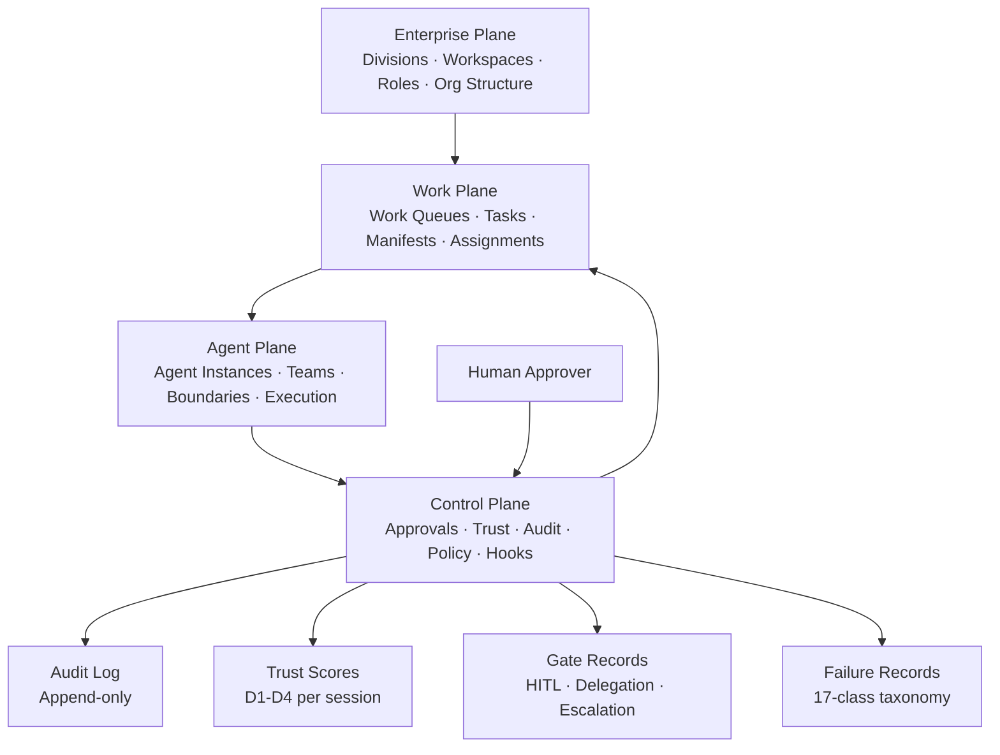

# Architecture Overview

**A visual map of the Agentic Workforce Framework's four planes
and their relationships.**

## Four-Plane Architecture

The control plane feeds back into the work plane: trust tier
changes affect which tasks an agent can be assigned. Gate records
determine whether a task can proceed. Failure records inform the
next session's pre-task retrieval.

## How the Planes Interact

| From | To | What flows | How |
|---|---|---|---|
| Enterprise Plane | Work Plane | Work authorization scope | Workspace boundaries define what work can be assigned within a team |
| Work Plane | Agent Plane | Task manifests | AgentTaskManifest carries mission, files in scope, risk level and verification required |
| Agent Plane | Control Plane | Execution events | Every agent action produces an audit event; hooks intercept actions before and after execution |
| Control Plane | Work Plane | Trust-gated assignment | Agent trust tier determines which risk levels it can be assigned; PROBATION agents cannot receive HIGH-risk tasks |
| Human Approver | Control Plane | HITL decisions | Human approval is required before HIGH/CRITICAL tasks execute; recorded in gate_records |

## Component Map by Plane

### Enterprise Plane

- Divisions table (org unit boundary)
- Workspaces table (team scope boundary)
- Workspace agents (role-agent alignment)
- Delegation rules (TTL-gated authority transfer)

### Work Plane

- Work queue items (task lifecycle: CREATED → COMPLETE)
- AgentTaskManifest (per-task contract)
- Manifest sidecar (hook validation artifact)
- Handoff files (cross-agent state transfer)

### Agent Plane

- Agent instances (persistent identity across sessions)
- Agent instruction files (capability boundary definition)
- Agent bulletin (real-time state log)
- Agent locks (file ownership during execution)

### Control Plane

- OS-level hooks (PreToolUse / SubagentStart / PostToolUse)
- Audit log (append-only, hook-written)
- Trust scores (D1-D4, session-level, evidence-required)
- Gate records (HITL / Delegation / Escalation / Approval)
- Failure records (17-class, recurrence-tracked)
- Routine runs (scheduled automation log)

## Reading Path

If you are new to the framework, read these in order:

1. This diagram (you are here)
2. `docs/architecture/four-plane-model.md` — full plane descriptions
3. `docs/architecture/enterprise-scaling.md` — multi-team extension
4. `docs/concepts/agentic-workforce-model.md` — agents-as-employees model
5. `docs/control-plane/pre-spawn-protocol.md` — control plane entry point
