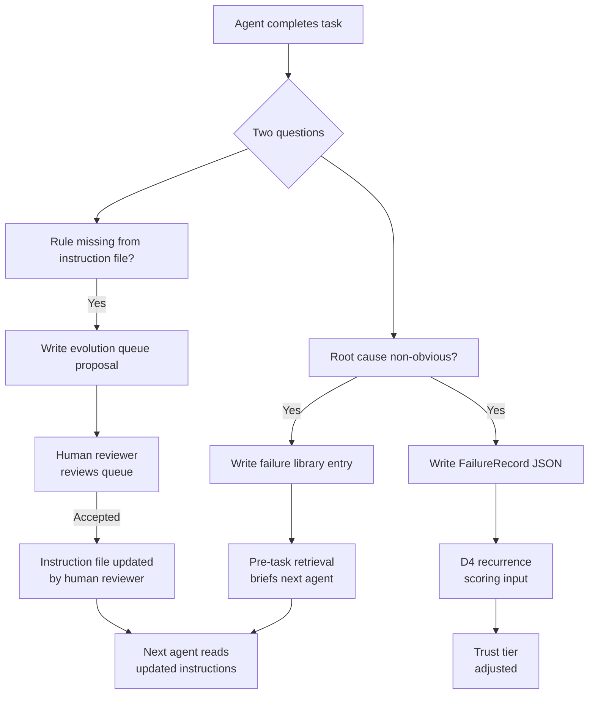

# Controlled Learning Protocol for Agentic Teams

> **This protocol does not allow agents to self-modify.**
> It allows agents to surface observed patterns, record failures and propose
> operating-model improvements. Human review remains the approval boundary.

**Status:** Reference Pattern
**Maturity:** Level 2 — Operating Model
**Applies to:** Orchestrator, QA Agent, Fix Agent, Frontend Agent, Backend Agent, Security-Check Agent
**Primary artifacts:** Failure library entry, FailureRecord, evolution queue proposal, D4 trust score

---

## What this concept defines

The controlled learning protocol is the mechanism by which the agentic workforce
improves its own operating model over time, without any agent modifying its
own instructions or policies directly.

The protocol closes a loop that most agent systems leave open: agents execute
tasks and produce outputs, but the operating model that governs how they execute
stays fixed. Without a controlled learning loop, the workforce accumulates
history without converting it into improved behavior. Mistakes repeat. Patterns
accumulate invisibly.

The controlled learning protocol makes institutional improvement explicit,
controlled and auditable.

---

## The learning loop



The agent surfaces. The human reviewer decides. The agent inherits the result.

The loop is intentionally asynchronous: agents may propose improvements during
session close, but instruction changes take effect only after human review.

---

## The two questions every agent asks after a task

After completing any task, every agent in the framework asks two questions:

**Question 1: Was the root cause non-obvious?**

Would another agent, reading only the task description and the instruction
file, have missed what this agent discovered? If yes, the pattern belongs in
the failure library so future agents can read it before starting similar work.

**Question 2: Is a rule missing from the instruction file?**

Is there a gap, ambiguity or incorrect instruction that would have made this
task go better if it had been written correctly? If yes, the proposed change
belongs in the evolution queue for the human reviewer to evaluate.

These two questions are part of the session close protocol for every agent.
An agent that skips them leaves institutional learning incomplete.

---

## The three artifacts the protocol produces

### 1. Failure library entry

A human-readable markdown entry that records what happened, why it happened
and what the pattern means for future work in that file or domain.

```
FILE:       [exact path where the failure occurred]
SYMPTOM:    [what the operator or user observed]
ROOT CAUSE: [why it was actually broken — confirmed cause, not hypothesis]
PATTERN:    [the rule to remember when working in this file or domain]
DATE:       [YYYY-MM-DD]
AGENT:      [agent role that surfaced the pattern]
---
```

Failure library entries are read before tasks, not after. The orchestrator
checks the failure library against the files in scope before any agent is
spawned. If a matching entry exists, the agent's task brief includes the
entry verbatim. The agent starts its work already aware of what broke here
before.

This is pre-task retrieval. It is the highest-leverage practice in the
framework and it costs nothing but discipline.

### 2. FailureRecord (structured JSON)

The formal artifact conforming to `schemas/v1/failure-record.schema.json`.
Where the failure library entry is human-readable pattern documentation, the
FailureRecord is the machine-readable record used for recurrence detection,
D4 trust scoring and pre-task retrieval matching.

Key fields: failureId, failureClass (17-class taxonomy), recurrenceCount,
rootCauseConfirmed, fixTag and preventionArtifacts.

The recurrenceCount is the critical signal. A count of 1 is a new failure.
A count of 2 means the pattern has recurred once after being documented.
A count of 3 or higher triggers mandatory systemic review — the framework
will not allow a recurring failure to be resolved as a hotfix indefinitely.

### 3. Evolution queue entry

A structured proposal for a change to an agent instruction file, policy file
or governance artifact. Filed in `governance/evolution-queue.md`.

```
PROPOSE ADD TO: [agent file or governance file]
RULE:           [exact text to add]
REASON:         [what defect this would have prevented; reference failureId]
DATE:           [YYYY-MM-DD]
AGENT:          [agent role surfacing the proposal]
STATUS:         PENDING
---
```

The evolution queue is where institutional learning accumulates as concrete
proposals. A growing queue is a healthy signal — agents are identifying gaps.
A stagnant queue with proposals filed but never reviewed is an operational
failure — the workforce is identifying improvements the organization is not
applying.

---

## The learning boundary rule

The most important constraint in the controlled learning protocol:

**No agent may apply changes to its own instruction file, policy files,
contract schemas or governance artifacts. It may only propose.**

This rule exists because self-modification without oversight creates behavioral
drift that is difficult to detect and difficult to reverse. An agent that
rewrites its own instructions based on what it just learned is an agent that
can rationalize its way out of any constraint.

The correct architecture separates learning from application:

```
Agent surfaces a pattern
    ↓
Failure library entry (agent writes)
Evolution queue proposal (agent writes)
    ↓
Human reviewer evaluates the queue
    ↓
Instruction file updated (human reviewer applies)
    ↓
Next agent reads updated instructions before starting
```

This separation is not a limitation. It is the correct design for a system
where behavioral trust must be earned over time and verified by a human reviewer.

---

## How the loop closes

The controlled learning protocol feeds back into every subsequent session
through three mechanisms:

**Pre-task retrieval.** Before any agent spawns, the orchestrator queries the
failure library for entries matching the files and domains in scope. If entries
exist, they are injected into the agent's task brief. The agent starts work
already aware of what broke in this area before.

**D4 trust scoring.** After each session, the agent is scored on D4 Recurrence:
did the agent repeat a pattern that was already in the failure library? An agent
that repeats a known failure scores lower than one that produces novel failures.
An agent briefed on a pattern that still repeated it scores D4=0 — a hard stop.

**Instruction file evolution.** Accepted proposals from the evolution queue are
applied to agent instruction files by the human reviewer. The next time any
agent of that role is spawned, it operates against an instruction file that
reflects what the workforce learned from prior sessions.

---

## A concrete example from the reference implementation

The failure library entry below is representative. Sanitized but structurally
accurate.

```
FILE:       server/hooks/check-agent-spawn.js
SYMPTOM:    Hook silently passed on Windows without blocking anything
ROOT CAUSE: /dev/stdin is Linux only. On Windows it throws and the catch
            exits 0, making every hook a no-op on that OS
PATTERN:    Always use fs.readFileSync(0) for stdin in Node.js hooks.
            Never use /dev/stdin directly. Test hooks on the target OS
            before marking the hook complete.
DATE:       2026-04-14
AGENT:      Fix-Agent
---
```

Without the failure library, the next agent touching any hook file would have
had no way to know this pattern existed. With pre-task retrieval, the
orchestrator injects this entry into the task brief before any agent touches
hook code.

The pattern costs one session to discover and zero additional sessions to
prevent from recurring. That asymmetry is the value of failure memory.

---

## What the protocol does not do

**It does not allow agents to self-modify.** The learning boundary rule is
absolute. Agents surface and propose. They do not apply changes to instruction
files, policy files or governance artifacts.

**It does not replace human judgment.** The human reviewer decides which
evolution queue proposals to accept, reject or defer. The protocol produces
high-quality, evidence-grounded proposals. It does not make the decisions.

**It does not guarantee improvement.** A failure library that is never read,
an evolution queue that is never reviewed and D4 scores that are not tracked
will not produce improvement. The protocol is a discipline that requires
consistent application. The value is proportional to the consistency.

**It does not handle all learning.** Some patterns require structural
refactoring that goes beyond what an instruction file update can address.
The systemic-refactor-required fixTag exists for this case. Those failures
are escalated and tracked separately from instruction-level improvements.

---

## Evolution queue review cadence

The evolution queue should be reviewed by the human reviewer at a regular
cadence. The reference implementation uses a minimum weekly review.

At review, each pending proposal receives one of five outcomes:

| Outcome | Meaning |
|---|---|
| Accepted | Reviewer will apply this change. Moves to sprint queue. |
| Rejected | The proposed change is incorrect, redundant or would cause unintended side effects. Marked rejected with a brief rationale. |
| Deferred | The change is correct but the timing is not right. Documented reason required. |
| Under review | Active consideration. More sessions of observation needed before deciding. |
| Implemented | The change has been applied. Record kept for audit trail. |

Rejected proposals are not deleted. They are marked rejected with a rationale.
The agent that proposed the change inherits that context in future sessions.
Rejection is also information.

---

## Relationship to trust scoring

The controlled learning protocol feeds directly into the D4 Recurrence
dimension of the D1-D4 trust scoring model.

D4 measures: did the agent repeat a failure pattern that was already in the
failure library before the session started?

An agent that consistently surfaces novel patterns and never repeats known ones
builds D4 trust over time. An agent that repeats known patterns — especially
patterns it was explicitly briefed on before starting work — loses D4 trust
and eventually triggers hard-stop rules that affect its autonomy tier.

The controlled learning protocol turns historical failure data into a behavioral
signal. It is not merely documentation. It is input to the trust model that
determines how much autonomy each agent can exercise.

---

## Cross-references

- Failure memory concept and 17-class taxonomy: [failure-memory.md](../concepts/failure-memory.md)
- FailureRecord schema: `schemas/v1/failure-record.schema.json`
- D4 Recurrence scoring: `calibration/d1-d4-rubric.md`
- Pre-spawn protocol and retrieval step: `docs/control-plane/pre-spawn-protocol.md`
- Evolution queue template: `governance/evolution-queue.md`
- Agent self-learning sections (per role): `agents/fix-agent.md`,
  `agents/agent-srv.md`, `agents/agent-fe.md`, `agents/orchestrator.md`
- Failure taxonomy adoption guide: `docs/guides/failure-taxonomy-adoption.md`
- Trust scoring overview: [trust-scoring.md](../concepts/trust-scoring.md)
- Autonomy gates: [autonomy-gates.md](../concepts/autonomy-gates.md)
